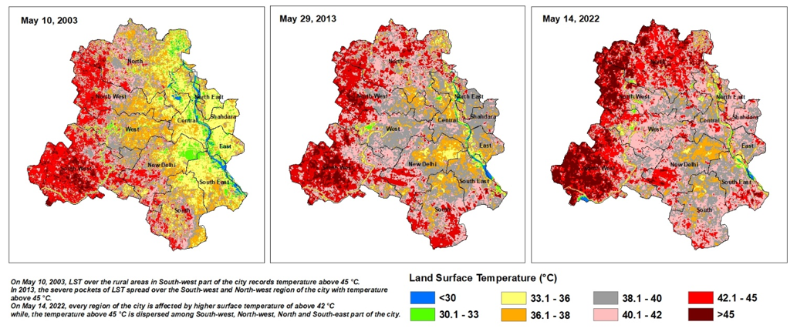
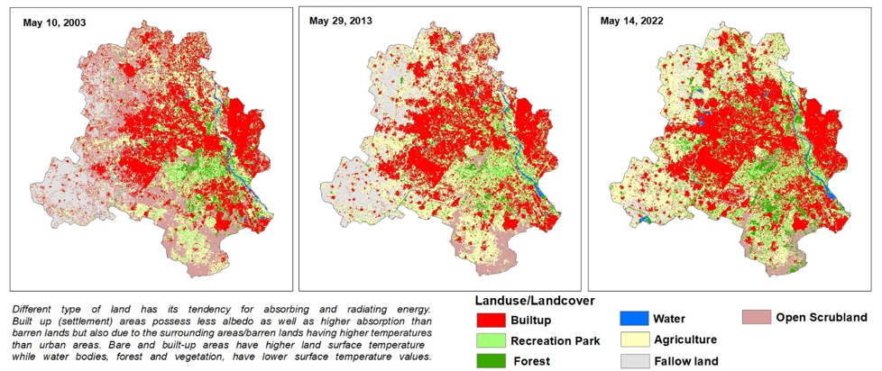
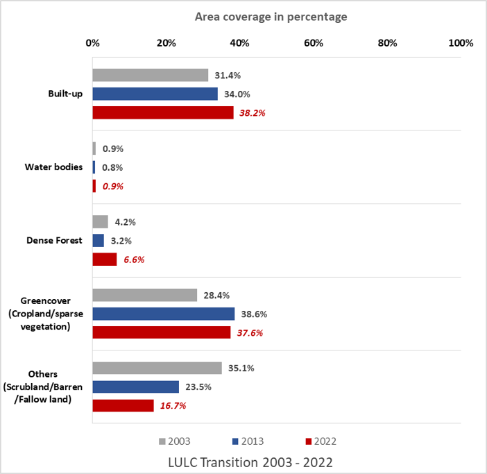
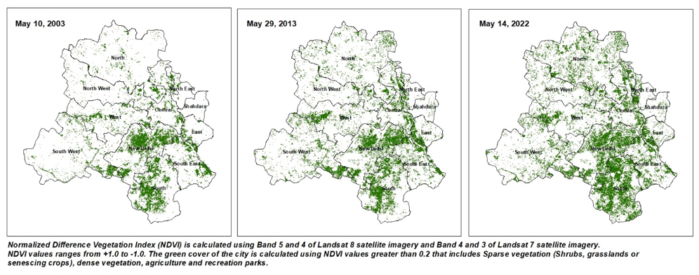
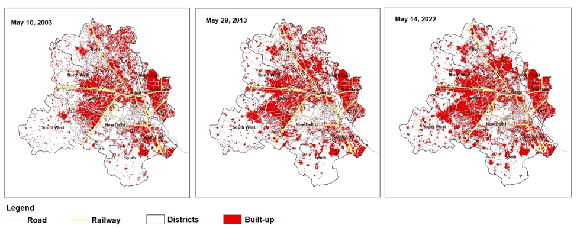
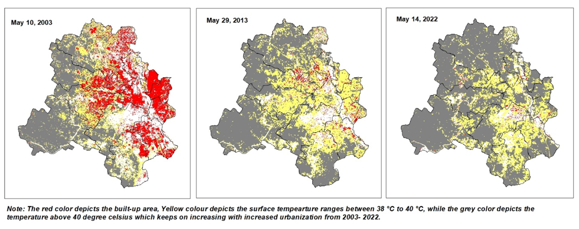

# Urban Heat, Land Surface Temperature & Land-Use Change Analysis

## Delhi, India | Multi-Year Remote Sensing & GIS Analysis

**Focus:** Urban Heat | Remote Sensing | GIS | LST | LULC | NDVI | NDBI | Spatial Analysis

---

## 1. Project Overview

This project examines the changing urban thermal environment of Delhi through satellite-based Land Surface Temperature (LST), Land Use/Land Cover (LULC), vegetation and built-up analysis.

The analysis uses multi-year satellite observations and GIS-based spatial analysis to understand changes in land cover and urbanisation and their relationship with the spatial distribution of heat.

The detailed satellite comparison presented in this portfolio focuses on 2003, 2013 and 2022.

### Core Question

How have changes in land cover, built-up areas and vegetation been associated with changes in Delhi's land-surface temperature and spatial heat patterns?

---

## 2. Objectives

- Analyse multi-year changes in Land Surface Temperature (LST).
- Map and compare Land Use/Land Cover (LULC) across selected years.
- Quantify changes in major land-cover categories.
- Analyse vegetation patterns using NDVI.
- Examine built-up patterns using NDBI and built-up mapping.
- Perform spatial overlays between LST and built-up/land-cover characteristics.
- Identify and map heat hotspots.
- Visualise changing spatial patterns of urban heat using GIS.

---

## 3. Study Area

**Delhi, India**

The analysis examines spatial variations in heat and land-cover characteristics across Delhi, including differences between densely urbanised areas and peripheral areas.

---

## 4. Data and Remote Sensing Inputs

| Dataset | Application |
| --- | --- |
| Landsat 7 ETM+ | LST, LULC and vegetation/built-up analysis |
| Landsat 8 OLI/TIRS | LST, LULC and vegetation/built-up analysis |
| MODIS LST | Supporting seasonal and long-term thermal analysis |
| IMD observations | Ambient temperature and humidity analysis |
| GIS boundary layers | Spatial analysis and map preparation |

The detailed satellite analysis used Landsat imagery for the selected years, while the wider urban heat assessment incorporated meteorological and MODIS-based thermal information.

---

## 5. Methodology

```text
                    SATELLITE DATA
                  Landsat 7 / Landsat 8
                           |
                           v
                 IMAGE PRE-PROCESSING
                           |
                           v
          +----------------+----------------+
          |                |                |
          v                v                v
         LST              LULC             NDVI
          |                |                |
          |                v                v
          |          LULC CHANGE       VEGETATION
          |             ANALYSIS         ANALYSIS
          |
          v
       NDBI /
    BUILT-UP ANALYSIS
          |
          v
    SPATIAL OVERLAY
       ANALYSIS
          |
          v
   LST + BUILT-UP +
      VEGETATION
          |
          v
   TEMPORAL COMPARISON
    2003 -> 2013 -> 2022
          |
          v
       HEAT HOTSPOT MAPPING
          |
          v
    URBAN HEAT
     ASSESSMENT
```

### Analytical Workflow

1. **Satellite image preparation**  
   Landsat imagery was prepared for the selected analysis years.

2. **Land Surface Temperature analysis**  
   Satellite thermal information was used to derive and map spatial LST patterns.

3. **LULC classification**  
   Land-cover categories were mapped and compared across the selected years.

4. **Vegetation analysis**  
   NDVI was used to assess the spatial distribution and change of vegetation/green cover.

5. **Built-up analysis**  
   Built-up areas were mapped and analysed using NDBI and spatial classification.

6. **Temporal comparison**  
   LST and LULC outputs were compared across 2003, 2013 and 2022.

7. **Spatial overlay**  
   LST was overlaid with built-up and land-cover information to identify areas where higher surface temperatures coincide with urbanised land.

8. **Heat hotspot identification**  
   Areas with elevated LST were mapped to visualise the spatial distribution of heat hotspots.

## 6. Land Surface Temperature Analysis

### LST Comparison: 2003, 2013 and 2022

The LST maps show spatial variation in surface temperature across Delhi and changes in the distribution of higher-temperature areas between the selected years.



---

## 7. Land Use/Land Cover Analysis

### LULC Comparison: 2003, 2013 and 2022

The analysis mapped major land-cover categories and compared their spatial distribution across the selected years.

The classification includes:

- Built-up
- Water bodies
- Dense forest
- Green cover/vegetation
- Open scrubland
- Fallow/barren land



---

## 8. LULC Change

The analysis shows an increase in Delhi's built-up share over the study period.

| Year | Built-up Share |
|---|---:|
| 2003 | 31.4% |
| 2013 | 34.0% |
| 2022 | 38.2% |

This represents an increase of **6.8 percentage** between 2003 and 2022.



---

## 9. NDVI and Vegetation Analysis

NDVI was used to identify and compare vegetation and green-cover patterns across the selected years.

The NDVI analysis provides an additional spatial layer for interpreting the relationship between vegetation and surface temperature.



---

## 10. NDBI and Built-Up Analysis

NDBI and built-up mapping were used to examine the spatial distribution and expansion of urbanised areas.

The built-up analysis was subsequently compared with LST to investigate spatial relationships between urbanisation and surface temperature.



---

## 11. LST and Built-Up Spatial Overlay

A spatial overlay was developed to examine the relationship between built-up areas and elevated surface temperature.

This analysis provides a spatial view of areas where urbanised land overlaps with higher surface-temperature ranges.



---

## 12. Heat Hotspot Mapping

Heat hotspot maps were developed using LST-based analysis to identify areas experiencing elevated surface temperatures.

The hotspot analysis provides a direct visual representation of the spatial distribution of high-LST areas across Delhi.

**Heat hotspot maps will be added here.**

---

## 13. Built-Up Area and Average LST

The analysis also compared changes in built-up coverage with average LST.

Built-up share increased from:

**31.4% in 2003 → 34.0% in 2013 → 38.2% in 2022**

The comparison was used to examine the relationship between urban expansion and the changing thermal environment.

**Built-up vs. average LST graph will be added here.**

> **Interpretation:** The comparison indicates an observed spatial and temporal association between increasing urbanisation and the changing thermal environment. This should be interpreted as an association rather than proof that LULC change alone caused the observed temperature changes.

---

## 14. Key Findings

### Urban Expansion

- Built-up land increased from **31.4% in 2003 to 38.2% in 2022**.
- The analysis shows expansion of urbanised areas across several parts of Delhi.

### Thermal Environment

- Higher LST zones became more spatially extensive in the later comparison years.
- The LST analysis shows strong spatial variation in surface temperature across Delhi.

### Vegetation and Surface Temperature

- Vegetated areas generally show comparatively lower surface temperatures.
- NDVI provides an additional spatial layer for understanding vegetation distribution and its relationship with surface temperature.

### Heat Hotspots

- Heat hotspots are not uniformly distributed across Delhi.
- Highly urbanised areas and areas with limited vegetation show stronger concentrations of elevated LST.

---

## 15. My Contribution

I led the geospatial analysis for this work, including:

- Satellite-based LST processing and analysis
- LULC classification and change analysis
- Multi-year temporal comparison
- NDVI and NDBI / built-up analysis
- Spatial overlay of LST with land-cover and built-up information
- Heat hotspot mapping
- Preparation of maps, graphs and visualisations
- GIS-based interpretation of urban heat patterns

### Technical Workflow

**Remote sensing data → GIS processing → raster analysis → classification → temporal comparison → spatial overlay → hotspot identification → visualisation**

---

## 16. Tools and Skills Demonstrated

### GIS and Remote Sensing

- ArcGIS / ArcMap
- Landsat 7 ETM+
- Landsat 8 OLI/TIRS
- Raster processing
- Land Surface Temperature mapping
- LULC classification
- NDVI
- NDBI / built-up analysis
- Spatial overlay
- Temporal change detection

### Environmental Analysis

- Urban heat assessment
- Heat hotspot identification
- Land-cover change analysis
- Urbanisation and thermal-environment analysis

### Data and Programming

- Python-based geospatial calculations
- Environmental data integration
- Quantitative visualisation

---

## 17. Portfolio Outputs

The project produces the following key outputs:

- Multi-year LST maps
- LULC classification maps
- LULC change graph
- NDVI maps
- NDBI / built-up maps
- LST and built-up spatial overlay
- Heat hotspot maps
- Built-up area versus average LST comparison

---

## 18. Why This Project Matters

Urban heat is a spatial problem. Different parts of the same city can experience substantially different thermal conditions depending on land cover, built-up density, vegetation and urban form.

This project demonstrates how satellite remote sensing and GIS can be combined to convert environmental data into spatial intelligence for understanding urban heat and identifying areas requiring further investigation or intervention.

---

## 19. Project Context

This portfolio project is based on geospatial and remote-sensing analysis undertaken as part of urban heat research at the **Centre for Science and Environment (CSE)**.

The project has been adapted as a technical portfolio case study to highlight the analytical workflow, geospatial methods, outputs and skills involved.

---

## Author

**Sharanjeet Kaur**

*Environmental Data & Geospatial Analytics | GIS | Remote Sensing | Urban Environmental Analysis*
